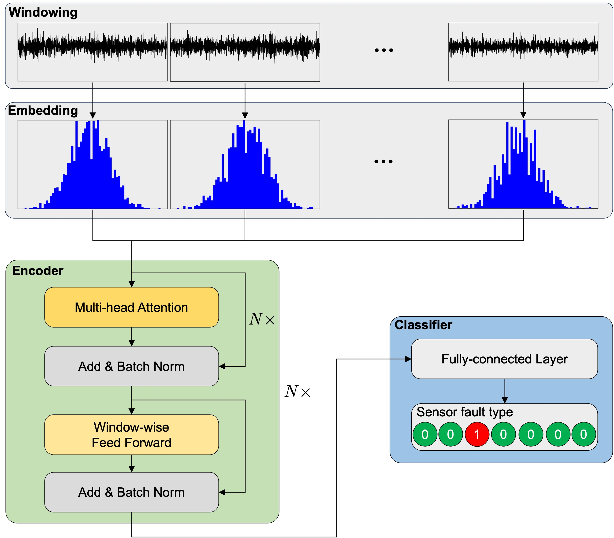
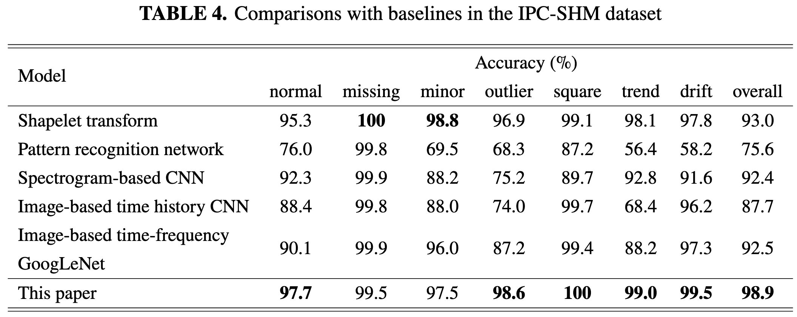
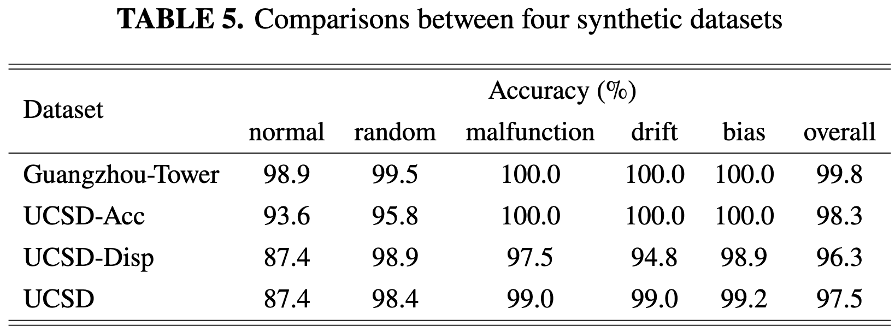

# Attention-based model for sensor fault classification

We propose an attention-based model for sensor fault detection. The model consists of three components, including data preprocessing, attention-based encoder, and classifier.



# Requirements

- Python>=3.11
- Pytorch>=2.1, CUDA=12.1
- A NVIDIA GPU with a minimal memory of 12GB (such as RTX 3060)

# Dataset

The datasets are available in [Google Drive](https://drive.google.com/drive/folders/1s_4ReX4GE4wyEXe13DmlJIdeUOtr9XB5?usp=sharing), including one real dataset and four synthetic datasets. The synthetic datasets are created by adding faulty data to the normal data according to [Benchmark Datasets for Fault Detection and Classification in Sensor Data](https://dl.acm.org/doi/10.5220/0005637901850195).

## IPC-SHM

An open-source sensor fault dataset provided by the [1st International Project Competition for Structural Health Monitoring](http://www.schm.org.cn/#/IPC-SHM,2020).  The dataset contains acceleration data from a long-span bridge in China with seven sensor fault types, including *normal*, *missing*, *minor*, *outlier*, *square*, *trend*, and *drift*.

## Guangzhou-Tower

The Guangzhou-Tower dataset originates from [A Benchmark Problem for Structural Health Monitoring of High-Rise Slender Structures](http://polyucee.hk/ceyxia/benchmark/index.htm). The dataset contains acceleration data from Guangzhou New TV Tower with five sensor fault types, including *normal*, *random*, *malfunction*, *drift*, and *bias*.

## UCSD-Acc

The UCSD-Acc dataset originates from [Shake Table Test of A Two-story Mass Timber Building with Post-tensioned Rocking Walls](https://designsafe-ci.org/data/browser/public/designsafe.storage.published/PRJ-1717). The dataset only contains acceleration data from a two-story timber building with five sensor fault types, including *normal*, *random*, *malfunction*, *drift*, and *bias*.

## UCSD-Disp

The UCSD-Disp dataset also originates from [Shake Table Test of A Two-story Mass Timber Building with Post-tensioned Rocking Walls](https://designsafe-ci.org/data/browser/public/designsafe.storage.published/PRJ-1717). The dataset only contains displacement data from a two-story timber building with five sensor fault types, including *normal*, *random*, *malfunction*, *drift*, and *bias*.

## UCSD

The UCSD dataset is a combination of UCSD-Acc and UCSD-Disp datasets.

# Setup

We recommend to run codes in a conda environment.

1. Create a new environment and activate it.

```bash
conda create -n sensor python=3.11 pip
conda activate sensor
```

2. Install PyTorch library with conda.

```bash
conda install pytorch==2.1.0 pytorch-cuda=12.1 -c pytorch -c nvidia
```

3. Install other dependencies for training.

```bash
pip install -r requirements.txt
```

# Quick start

Run the following commands to train our model:

```bash
chmod +x ./train.sh
./train.sh
```

Alternatively, you can run the model with your own hyperparameters by:

```bash
python main.py \
  -dataset <DATASET> \
  -feature <FEATURE> \
  -batch <BATCH> \
  -seq_len <SEQ_LEN> \
  -win_len <WIN_LEN> \
  -hist_bin <HIST_BIN> \
  -d_ff <D_FF> \
  -n_class <N_CLASS> \
  -dropout <DROPOUT> \
  -head <HEAD> \
  -n_att <N_ATT> \
  -n_sublayers <N_SUBLAYERS> \
  -n_encoders <N_ENCODERS> \
  -random_seed <RANDOM_SEED> \
  -data_aug
```

# Results

Our model outperforms baselines by a great margin in the overall accuracy, with each sensor fault type achieving high accuracy.

Our model also achieves superior performance in four synthetic datasets, demontarting the generalization of our model.



# Animations

The following animations demonstrate how our model predicts normal and drift data in the IPC-SHM dataset. A sample in the IPC-SHM dataset is recorded over one hour at a sampling rate of 20 Hz.  In the following animations, our model outputs a label every 100 s by setting the window size to 2000.

## Normal


## Drift


# Citation

If you found this work useful for you, please consider citing it.
