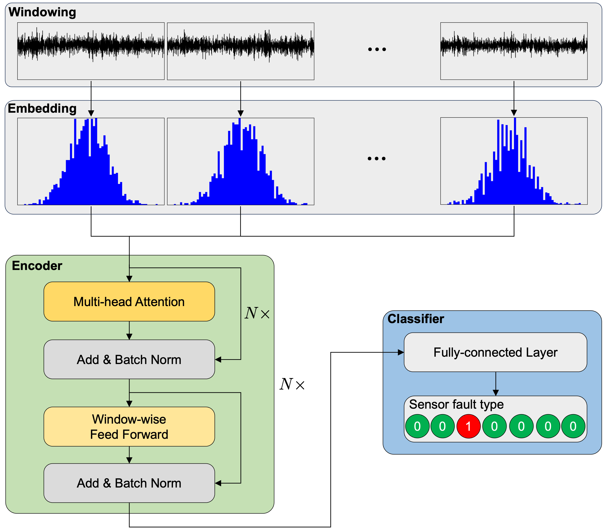

# Attention-based model for sensor fault classification

We propose an attention-based model for sensor fault detection. The model consists of three components, including data preprocessing, attention-based encoder, and classifier.

# Requirements

# Dataset

# Quick start

# Results

